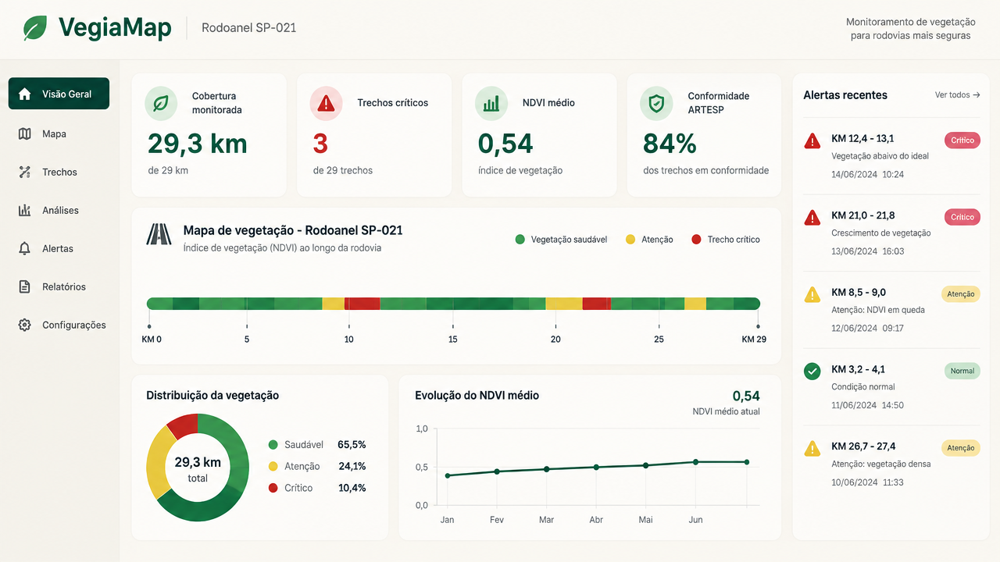

# VegiaMap — Monitoramento de Vegetação Rodoviária



> Painel operacional para concessões rodoviários acompanharem o comprimento da vegetação na faixa de domínio, priorizarem roçadas e reduzirem o risco de multas regulatórias.

---

## O que é

O **VegiaMap** é uma aplicação web desenvolvida para a **Motiva / Rodoanel SP-021** que transforma imagens de satélite e dados operacionais em informação acionável para equipes de campo.

Em vez de depender de inspeções manuais em toda a extensão da rodovia, o sistema cruza:

- **Imagens Sentinel-2** processadas no Google Earth Engine (NDVI, EVI, SAVI);
- **Previsão meteorológica** (Open-Meteo) para antecipar aceleração do crescimento;
- **Histórico de roçadas** para saber onde a vegetação está crescendo há mais tempo;
- **Medições de campo** (régua) para calibrar o modelo e não fingir precisão.

O resultado é um painel onde o supervisor vê, em uma tela só, os trechos críticos, o mapa de calor ao longo dos quilômetros, a altura estimada em centímetros e a recomendação de ação.

---

## Funcionalidades principais

- **Dashboard operacional** com KPIs de cobertura, trechos críticos, NDVI médio e conformidade estimada.
- **Mapa interativo** com pontos por quilômetro, altura estimada e origem do dado (satélite, campo, demonstrativo).
- **Heatmap linear** do traçado da rodovia com segmentos coloridos por criticidade.
- **Detalhamento por trecho** (`/segmento/:id`): altura, limite contratual, histórico de NDVI, última roçada e recomendação de ação.
- **Relatório de conformidade** com filtros, ordenação e exportação para PDF/CSV/GeoJSON.
- **Planejamento e priorização** com Índice de Risco de Crescimento (IRC) e alocação sugerida de equipes.
- **Alertas e notificações** centralizados para acompanhamento de prazos.
- **Modo demonstração** para apresentações sem depender de leituras de satélite.
- **Tema claro/escuro** e interface responsiva para uso em tablets e celulares.

---

## Demonstração ao vivo

🌐 **Aplicação publicada**: [https://sistema-de-monitoramento-motiva.lovable.app](https://sistema-de-monitoramento-motiva.lovable.app)

> O acesso às rotas protegidas exige autenticação. A raiz (`/`) redireciona para a tela de login.

---

## Stack tecnológica

| Camada | Tecnologia |
|--------|------------|
| Frontend | React 18 + Vite 5 + TypeScript 5 |
| Estilos | Tailwind CSS 3 + shadcn/ui + Radix |
| Roteamento | React Router 6 |
| Estado | React Query (TanStack Query), Context API |
| Backend / Banco | Lovable Cloud (Supabase): Postgres, Auth, Edge Functions |
| Dados externos | Google Earth Engine, Open-Meteo, OpenStreetMap / OSRM |
| Testes | Vitest + Testing Library |
| Build/deploy | Vite → Lovable Cloud |

---

## Rodando localmente

```bash
# 1. Clone o repositório
git clone <url-do-repositorio>
cd <nome-do-repositorio>

# 2. Instale as dependências
npm install
# ou
bun install

# 3. Inicie o servidor de desenvolvimento
npm run dev
```

O app estará disponível em `http://localhost:8080`.

### Outros comandos úteis

```bash
npm run build       # build de produção
npm run test        # executa todos os testes (Vitest)
npm run lint        # lint do projeto
```

---

## Documentação

A documentação técnica completa está na pasta [`docs/`](./docs):

- [`docs/ARQUITETURA.md`](./docs/ARQUITETURA.md) — estrutura do projeto, rotas, fluxo de dados e integrações.
- [`docs/MATEMATICA.md`](./docs/MATEMATICA.md) — como a estimativa de altura funciona, fórmulas e limitações.
- [`docs/DADOS.md`](./docs/DADOS.md) — fontes de dados, tabelas e pipeline de satélite.
- [`docs/ROADMAP.md`](./docs/ROADMAP.md) — evolução do projeto, fase por fase, incluindo o que foi descartado e por quê.

---

## Avisos importantes

- **O satélite não mede altura diretamente.** A altura mostrada é uma estimativa produzida por modelo e deve ser confirmada em campo quando estiver próxima do limite contratual.
- **A margem de ±2,9 cm** foi medida por validação cruzada nos 2 locais calibrados, contra a **média do trecho**, usando composição de ~12 imagens Sentinel-2. Não é uma precisão garantida para qualquer ponto isolado.
- **O modelo ainda é prova de conceito** enquanto não houver 8 a 10 locais calibrados com pelo menos 5 réguas cada e imagens Sentinel-2 a no máximo 3 dias da medição de campo.
- **Decisão contratual**: o sistema indica "validar em campo" sempre que a faixa de incerteza toca ou cruza o limite aplicável (30 cm, 45 cm ou 60 cm, conforme a cláusula do ativo).

---

## Licença

Este projeto foi desenvolvido como entrega para a **Motiva / Rodoanel SP-021**. O código-fonte é de propriedade do cliente, salvo bibliotecas de terceiros sob suas respectivas licenças.

---

*Construído com [Lovable](https://lovable.dev).*
